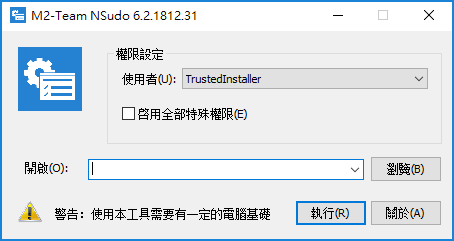


# NSudo - 一個強大的系統管理工具

[![appveyor.badge]][appveyor.link] 
[![release.badge]][release.link]
[![latestdownloads.badge]][latestdownloads.link]
[![totaldownloads.badge]][totaldownloads.link]
[![license.badge]][license.link]

- [简体中文](自述.md)
- [English](Readme.md)



- 注意：NSudo基於raymai97的 SuperCMD，請參閱 
  [這裡](http://bbs.pcbeta.com/viewthread-1508863-1-1.html "這裡") 以獲取更多關
  於 SuperCMD 的信息。

## 介紹
以下是與NSudo有關的第三方介紹鏈接。
- MajorGeeks: https://www.majorgeeks.com/files/details/nsudo.html
- softpedia.com: https://www.softpedia.com/get/Tweak/System-Tweak/NSudo.shtml
- TrishTech.com: https://www.trishtech.com/2018/11/nsudo-run-programs-with-full-privileges-in-windows/
- Wilders Security Forums: https://www.wilderssecurity.com/threads/396818

## 系統要求
- 支持的系統版本：Windows NT 6.0 及之後版本
- 支持的處理器架構：x86, x86-64(AMD64), ARM, ARM64

## 使用方法
- 請開啟【CPU 架構】目錄，然後按兩下 NSudo.exe. 根據提示操作即可。
  - 例如，如果你想在你的 Intel 或 AMD 設備上使用64位 NSudo，你首先需要開啟的是 
    x64 目錄，然後按兩下 NSudoG.exe。

## 命令列選項

```
格式: NSudo [ 選項與參數 ] 命令列執行或常用任務名

選項:

-U:[ 選項 ] 以指定使用者選項建立處理程序。
可用選項：
    T TrustedInstaller
    S System
    C 當前使用者
    P 當前處理程序
    D 當前處理程序 (降權)
PS：這是一個必須被包含的參數。

-P:[ 選項 ] 以指定特殊權限選項建立處理程序。
可用選項：
    E 啓用全部特殊權限
    D 禁用所有特殊權限
PS：如果想以默認特殊權限選項建立處理程序，請不要包含「-P」參數。

-M:[ 選項 ] 以指定完整性選項建立處理程序。
可用選項：
    S 系統
    H 高
    M 中
    L 低
PS：如果想以默認完整性選項建立處理程序的話，請不要包含「-M」參數。

-Priority:[ 選項 ] 以指定處理程序優先級選項建立處理程序。
可用選項：
    Idle 低
    BelowNormal 低於正常
    Normal 正常
    AboveNormal 高於正常
    High 高
    RealTime 實時
PS：如果想以默認處理序優先權選項建立處理程序，請不要包含「-Priority」參數。

-ShowWindowMode:[ 選項 ] 以指定視窗模式選項建立處理程序。
可用選項：
    Show 顯示視窗
    Hide 隱藏視窗
    Maximize 最大化
    Minimize 最小化
PS：如果想以默認視窗模式選項建立處理程序的話，請不要包含「-ShowWindowMode」參數。

-Wait 令 NSudo 等待建立的處理程序結束後再退出。
PS：如果不想等待，請不要包含「-Wait」參數。

-CurrentDirectory:[ 目錄路徑 ] 設置處理程序的的當前目錄。
PS：如果你想用 NSudo 的當前目錄，請不要包含「-CurrentDirectory」參數。

-UseCurrentConsole 使用當前控制台視窗建立處理程序。
PS：如果你想在新控制台視窗建立處理程序，請不要包含「-UseCurrentConsole」參數。

-Version 顯示 NSudo 版本資訊。

-? 顯示該內容。
-H 顯示該內容。
-Help 顯示該內容。

上下文清單管理：
  -Install   把NSudo複製到Windows目錄並且添加上下文清單。
  -Uninstall 移除在Windows目錄的NSudo和上下文清單。

PS：
    1. 所有的NSudo命令列參數不區分大小寫。
    2. 可以在命令列參數中使用 "/" 或 "--" 代替 "-" 和使用 "=" 代替 ":"。例如
       "/U:T" 和 "-U=T" 是等價的。
    3. 為了保證最佳體驗，NSudoC不支持上下文清單。

例子：
    以TrustedInstaller權限，啓用所有特殊權限，完整性默認執行命令提示字元
        NSudo -U:T -P:E cmd
```
關於常用列表的自訂,可以使用記事本等工具編輯NSudo.json。你可以照著示例的做法添
加你的自訂項目：
```
{
  "ShortCutList_V2": {
    "命令提示字元": "cmd",
    "PowerShell": "powershell",
    "PowerShell ISE": "powershell_ise",
    "Hosts編輯": "notepad %windir%\\System32\\Drivers\\etc\\hosts"
  }
}
```

從 NSudo 5.0.1708.16 開始命令列支持嵌套引號，例如：
> NSudo -U:T cmd /c "dir "C:\Program Files" & pause"

## 使用的第三方庫
- JSON for Modern C++
  - 著作權：Niels Lohmann
  - 授權：https://github.com/nlohmann/json/blob/develop/LICENSE.MIT
- （可選）VC-LTL
  - 著作權：初雨團隊
  - 授權：https://github.com/Chuyu-Team/VC-LTL/blob/master/LICENSE.txt

## Git 倉庫列表
- GitHub（主倉庫）
  - https://github.com/M2Team/NSudo
- OSChina（鏡像倉庫）
  - https://gitee.com/M2-Team/NSudo

## 文件
- [NSudo 變更紀錄](變更紀錄.md)
- [NSudo 相關人士](People.md)
- [NSudo's Code of Conduct](CODE_OF_CONDUCT.md)
- [Contributing to NSudo](CONTRIBUTING.md)

## 聯繫方式
- MDL 論壇帖子：https://forums.mydigitallife.net/threads/59268/
- 52pojie 論壇帖子：https://www.52pojie.cn/thread-847059-1-1.html
- 電郵：Mouri_Naruto@Outlook.com

## Have a good time -- M2-Team參上

[appveyor.badge]: https://ci.appveyor.com/api/projects/status/github/M2Team/NSudo?branch=master&svg=true
[appveyor.link]: https://ci.appveyor.com/project/MouriNaruto/nsudo
[release.badge]: https://img.shields.io/github/release/M2Team/NSudo.svg
[release.link]: https://github.com/M2Team/NSudo/releases/latest
[latestdownloads.badge]: https://img.shields.io/github/downloads/M2Team/NSudo/latest/total.svg
[latestdownloads.link]: https://github.com/M2Team/NSudo/releases/latest
[totaldownloads.badge]: https://img.shields.io/github/downloads/M2Team/NSudo/total.svg
[totaldownloads.link]: https://github.com/M2Team/NSudo/releases
[license.badge]: https://img.shields.io/github/license/M2Team/NSudo.svg
[license.link]: LICENSE
